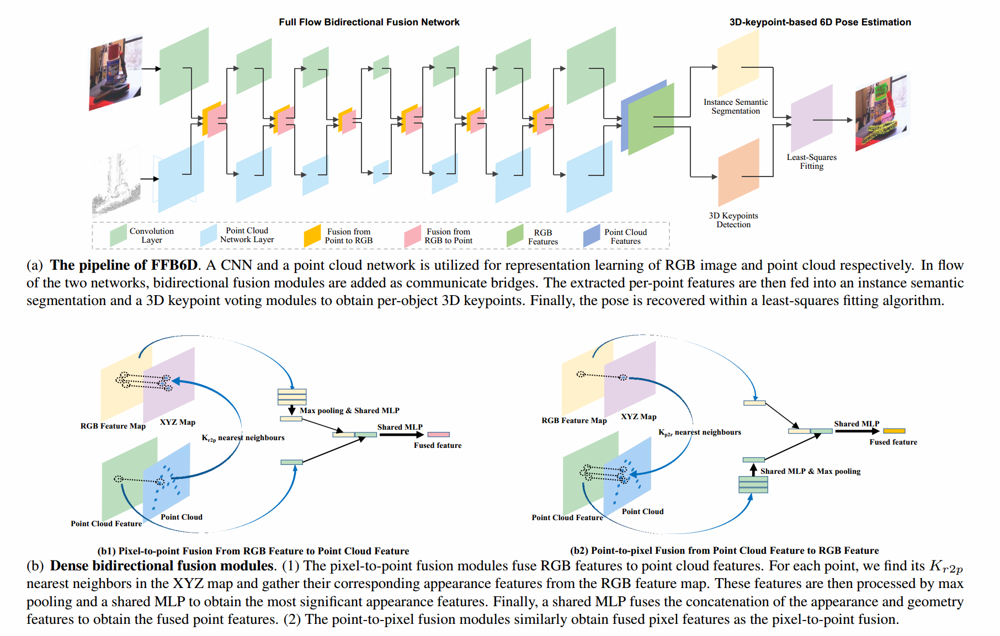
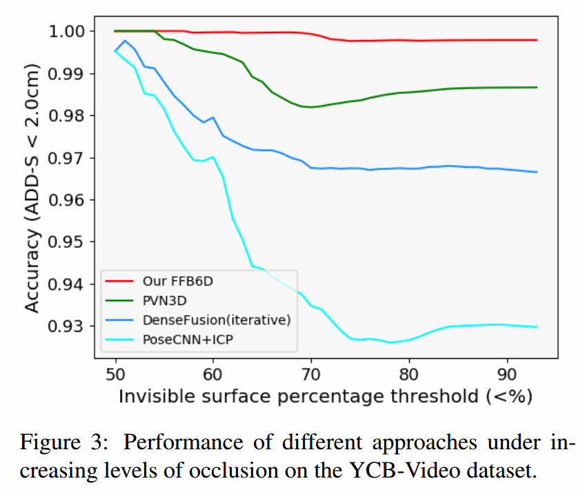
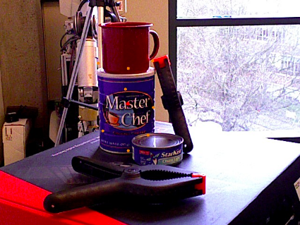

# FFB6D
This is the official source code for the **CVPR2021 Oral** work, **FFB6D: A Full Flow Biderectional Fusion Network for 6D Pose Estimation**. ([Arxiv](https://arxiv.org/abs/2103.02242), [Video_Bilibili](https://www.bilibili.com/video/BV1YU4y1a7Kp?from=search&seid=8306279574921937158), [Video_YouTube](https://www.youtube.com/watch?v=SSi2TnyD6Is))

## Table of Content

- [FFB6D](#ffb6d)
  - [Table of Content](#table-of-content)
  - [Introduction & Citation](#introduction--citation)
  - [Demo Video](#demo-video)
  - [Installation](#installation)
  - [Code Structure](#code-structure)
  - [Datasets](#datasets)
  - [Training and evaluating](#training-and-evaluating)
    - [Training on the LineMOD Dataset](#training-on-the-linemod-dataset)
    - [Evaluating on the LineMOD Dataset](#evaluating-on-the-linemod-dataset)
    - [Demo/visualizaion on the LineMOD Dataset](#demovisualizaion-on-the-linemod-dataset)
    - [Training on the YCB-Video Dataset](#training-on-the-ycb-video-dataset)
    - [Evaluating on the YCB-Video Dataset](#evaluating-on-the-ycb-video-dataset)
    - [Demo/visualization on the YCB-Video Dataset](#demovisualization-on-the-ycb-video-dataset)
  - [Results](#results)
  - [Adaptation to New Dataset](#adaptation-to-new-dataset)
  - [License](#license)

## Introduction & Citation
<div align=center></div>

[FFB6D](https://arxiv.org/abs/2103.02242v1) is a general framework for representation learning from a single RGBD image, and we applied it to the 6D pose estimation task by cascading downstream prediction headers for instance semantic segmentation and 3D keypoint voting prediction from PVN3D([Arxiv](https://arxiv.org/abs/1911.04231), [Code](https://github.com/ethnhe/PVN3D), [Video](https://www.bilibili.com/video/av89408773/)). 
At the representation learning stage of FFB6D, we build **bidirectional** fusion modules in the **full flow** of the two networks, where fusion is applied to each encoding and decoding layer. In this way, the two networks can leverage local and global complementary information from the other one to obtain better representations. Moreover, at the output representation stage, we designed a simple but effective 3D keypoints selection algorithm considering the texture and geometry information of objects, which simplifies keypoint localization for precise pose estimation.

Please cite [FFB6D](https://arxiv.org/abs/2103.02242v1) & [PVN3D](https://arxiv.org/abs/1911.04231) if you use this repository in your publications:

```
@InProceedings{He_2021_CVPR,
author = {He, Yisheng and Huang, Haibin and Fan, Haoqiang and Chen, Qifeng and Sun, Jian},
title = {FFB6D: A Full Flow Bidirectional Fusion Network for 6D Pose Estimation},
booktitle = {IEEE/CVF Conference on Computer Vision and Pattern Recognition (CVPR)},
month = {June},
year = {2021}
}

@InProceedings{He_2020_CVPR,
author = {He, Yisheng and Sun, Wei and Huang, Haibin and Liu, Jianran and Fan, Haoqiang and Sun, Jian},
title = {PVN3D: A Deep Point-Wise 3D Keypoints Voting Network for 6DoF Pose Estimation},
booktitle = {IEEE/CVF Conference on Computer Vision and Pattern Recognition (CVPR)},
month = {June},
year = {2020}
}
```

## Demo Video
See our demo video on [YouTube](https://www.youtube.com/watch?v=SSi2TnyD6Is) or [bilibili](https://www.bilibili.com/video/BV1YU4y1a7Kp?from=search&seid=8306279574921937158).
## Installation
- Install CUDA 10.1 / 10.2
- Set up python3 environment from requirement.txt:
  ```shell
  pip3 install -r requirement.txt 
  ```
- Install [apex](https://github.com/NVIDIA/apex):
  ```shell
  git clone https://github.com/NVIDIA/apex
  cd apex
  export TORCH_CUDA_ARCH_LIST="6.0;6.1;6.2;7.0;7.5"  # set the target architecture manually, suggested in issue https://github.com/NVIDIA/apex/issues/605#issuecomment-554453001
  pip3 install -v --disable-pip-version-check --no-cache-dir --global-option="--cpp_ext" --global-option="--cuda_ext" ./
  cd ..
  ```
- Install [normalSpeed](https://github.com/hfutcgncas/normalSpeed), a fast and light-weight normal map estimator:
  ```shell
  git clone https://github.com/hfutcgncas/normalSpeed.git
  cd normalSpeed/normalSpeed
  python3 setup.py install --user
  cd ..
  ```
- Install tkinter through ``sudo apt install python3-tk``

- Compile [RandLA-Net](https://github.com/qiqihaer/RandLA-Net-pytorch) operators:
  ```shell
  cd ffb6d/models/RandLA/
  sh compile_op.sh
  ```

## Code Structure
<details>
  <summary>[Click to expand]</summary>

- **ffb6d**
  - **ffb6d/common.py**: Common configuration of dataset and models, eg. dataset path, keypoints path, batch size and so on.
  - **ffb6d/datasets**
    - **ffb6d/datasets/linemod/**
      - **ffb6d/datasets/linemod/linemod_dataset.py**: Data loader for LineMOD dataset.
      - **ffb6d/datasets/linemod/dataset_config/models_info.yml**: Object model info of LineMOD dataset.
      - **ffb6d/datasets/linemod/kps_orb9_fps**
        - **ffb6d/datasets/linemod/kps_orb9_fps/{obj_name}_8_kps.txt**: ORB-FPS 3D keypoints of an object in the object coordinate system.
        - **ffb6d/datasets/linemod/kps_orb9_fps/{obj_name}_corners.txt**: 8 corners of the 3D bounding box of an object in the object coordinate system.
    - **ffb6d/datasets/ycb**
      - **ffb6d/datasets/ycb/ycb_dataset.py**： Data loader for YCB_Video dataset.
        - **ffb6d/datasets/ycb/dataset_config/classes.txt**: Object list of YCB_Video dataset.
        - **ffb6d/datasets/ycb/dataset_config/radius.txt**: Radius of each object in YCB_Video dataset.
        - **ffb6d/datasets/ycb/dataset_config/train_data_list.txt**: Training set of YCB_Video datset.
        - **ffb6d/datasets/ycb/dataset_config/test_data_list.txt**: Testing set of YCB_Video dataset.
      - **ffb6d/datasets/ycb/ycb_kps**
        - **ffb6d/datasets/ycb/ycb_kps/{obj_name}_8_kps.txt**: ORB-FPS 3D keypoints of an object in the object coordinate system.
        - **ffb6d/datasets/ycb/ycb_kps/{obj_name}_corners.txt**: 8 corners of the 3D bounding box of an object in the object coordinate system.
  - **ffb6d/models**
    - **ffb6d/models/ffb6d.py**: Network architecture of the proposed FFB6D.
    - **ffb6d/models/cnn**
      - **ffb6d/models/cnn/extractors.py**: Resnet backbones.
      - **ffb6d/models/cnn/pspnet.py**: PSPNet decoder.
      - **ffb6d/models/cnn/ResNet_pretrained_mdl**: Resnet pretraiend model weights.
    - **ffb6d/models/loss.py**: loss calculation for training of FFB6D model.
    - **ffb6d/models/pytorch_utils.py**: pytorch basic network modules.
    - **ffb6d/models/RandLA/**: pytorch version of RandLA-Net from [RandLA-Net-pytorch](https://github.com/qiqihaer/RandLA-Net-pytorch)
  - **ffb6d/utils**
    - **ffb6d/utils/basic_utils.py**: basic functions for data processing, visualization and so on.
    - **ffb6d/utils/meanshift_pytorch.py**: pytorch version of meanshift algorithm for 3D center point and keypoints voting. 
    - **ffb6d/utils/pvn3d_eval_utils_kpls.py**: Object pose esitimation from predicted center/keypoints offset and evaluation metrics.
    - **ffb6d/utils/ip_basic**: Image Processing for Basic Depth Completion from [ip_basic](https://github.com/kujason/ip_basic).
    - **ffb6d/utils/dataset_tools**
      - **ffb6d/utils/dataset_tools/DSTOOL_README.md**: README for dataset tools.
      - **ffb6d/utils/dataset_tools/requirement.txt**: Python3 requirement for dataset tools.
      - **ffb6d/utils/dataset_tools/gen_obj_info.py**: Generate object info, including SIFT-FPS 3d keypoints, radius etc.
      - **ffb6d/utils/dataset_tools/rgbd_rnder_sift_kp3ds.py**: Render rgbd images from mesh and extract textured 3d keypoints (SIFT/ORB).
      - **ffb6d/utils/dataset_tools/utils.py**: Basic utils for mesh, pose, image and system processing.
      - **ffb6d/utils/dataset_tools/fps**: Furthest point sampling algorithm.
      - **ffb6d/utils/dataset_tools/example_mesh**: Example mesh models.
  - **ffb6d/train_ycb.py**: Training & Evaluating code of FFB6D models for the YCB_Video dataset.
  - **ffb6d/demo.py**: Demo code for visualization.
  - **ffb6d/train_ycb.sh**: Bash scripts to start the training on the YCB_Video dataset.
  - **ffb6d/test_ycb.sh**: Bash scripts to start the testing on the YCB_Video dataset.
  - **ffb6d/demo_ycb.sh**: Bash scripts to start the demo on the YCB_Video_dataset.
  - **ffb6d/train_lm.py**: Training & Evaluating code of FFB6D models for the LineMOD dataset.
  - **ffb6d/train_lm.sh**: Bash scripts to start the training on the LineMOD dataset.
  - **ffb6d/test_lm.sh**: Bash scripts to start the testing on the LineMOD dataset.
  - **ffb6d/demo_lm.sh**: Bash scripts to start the demo on the LineMOD dataset.
  - **ffb6d/train_log**
    - **ffb6d/train_log/ycb**
      - **ffb6d/train_log/ycb/checkpoints/**: Storing trained checkpoints on the YCB_Video dataset.
      - **ffb6d/train_log/ycb/eval_results/**: Storing evaluated results on the YCB_Video_dataset.
      - **ffb6d/train_log/ycb/train_info/**: Training log on the YCB_Video_dataset.
- **requirement.txt**: python3 environment requirements for pip3 install.
- **figs/**: Images shown in README.

</details>

## Datasets
- **LineMOD:** Download the preprocessed LineMOD dataset from [onedrive link](https://hkustconnect-my.sharepoint.com/:u:/g/personal/yhebk_connect_ust_hk/ETW6iYHDbo1OsIbNJbyNBkABF7uJsuerB6c0pAiiIv6AHw?e=eXM1UE) or [google drive link](https://drive.google.com/drive/folders/19ivHpaKm9dOrr12fzC8IDFczWRPFxho7) (refer from [DenseFusion](https://github.com/j96w/DenseFusion)). Unzip it and link the unzipped ``Linemod_preprocessed/`` to ``ffb6d/datasets/linemod/Linemod_preprocessed``:
  ```shell
  ln -s path_to_unzipped_Linemod_preprocessed ffb6d/dataset/linemod/
  ```
  Generate rendered and fused data following [raster_triangle](https://github.com/ethnhe/raster_triangle).

- **YCB-Video:** Download the YCB-Video Dataset from [PoseCNN](https://rse-lab.cs.washington.edu/projects/posecnn/). Unzip it and link the unzipped```YCB_Video_Dataset``` to ```ffb6d/datasets/ycb/YCB_Video_Dataset```:

  ```shell
  ln -s path_to_unzipped_YCB_Video_Dataset ffb6d/datasets/ycb/
  ```

## Training and evaluating

### Training on the LineMOD Dataset
- Train the model for the target object. Take object ape for example:
  ```shell
  cd ffb6d
  # commands in train_lm.sh
  n_gpu=8
  cls='ape'
  python3 -m torch.distributed.launch --nproc_per_node=$n_gpu train_lm.py --gpus=$n_gpu --cls=$cls
  ```
  The trained checkpoints are stored in ``train_log/linemod/checkpoints/{cls}/``, ``train_log/linemod/checkpoints/ape/`` in this example.
  
  **A tip for saving GPU memory**: you can open the mixed precision mode to save GPU memory by passing parameters ```opt_level=O1``` to ```train_lm.py```. The document for apex mixed precision trainnig can be found [here](https://nvidia.github.io/apex/amp.html?highlight=opt_level). If you use less than 8 GPU and the batch size is less than "3x8=24", it's recommended to use mixed precision trainning and increase the ```mini_batch_size``` in ```common.py``` as large as possible.


### Evaluating on the LineMOD Dataset
- Start evaluation by:
  ```shell
  # commands in test_lm.sh
  cls='ape'
  tst_mdl="./linemod_pretrained/FFB6D_${cls}_best.pth.tar"
  python3 -m torch.distributed.launch --nproc_per_node=1 train_lm.py --gpu '0' --cls $cls -eval_net -checkpoint $tst_mdl -test -test_pose # -debug
  ```
  You can evaluate different checkpoint by revising ``tst_mdl`` to the path of your target model.
- **Pretrained model**: We provide our pre-trained models for each object on onedrive, [link](https://hkustconnect-my.sharepoint.com/:f:/g/personal/yhebk_connect_ust_hk/Ehg--MMyNdtLnAEurN0tm_MBQ8u_Lntrl42-BQeXO_8H8Q?e=HsZ2Yi). (The provided pretrained model here get better performance than we reported in our paper, mean ADD-0.1d 99.8). Download them and move them to their according folders. For example, move the ``FFB6D_ape_best.pth.tar`` to ``train_log/linemod/checkpoints/ape/``. Then revise ``tst_mdl=train_log/linemod/checkpoints/ape/FFB6D_ape_best.path.tar`` for testing.

### Demo/visualizaion on the LineMOD Dataset
- After training your models or downloading the pre-trained models, you can start the demo by:
  ```shell
  # commands in demo_lm.sh
  cls='ape'
  tst_mdl=train_log/linemod/checkpoints/${cls}/FFB6D_${cls}_best.pth.tar
  python3 -m demo -dataset linemod -checkpoint $tst_mdl -cls $cls -show
  ```
  The visualization results will be stored in ``train_log/linemod/eval_results/{cls}/pose_vis``

### Training on the YCB-Video Dataset
- Start training on the YCB-Video Dataset by:
  ```shell
  # commands in train_ycb.sh
  n_gpu=8  # number of gpu to use
  python3 -m torch.distributed.launch --nproc_per_node=$n_gpu train_ycb.py --gpus=$n_gpu
  ```
  The trained model checkpoints are stored in ``train_log/ycb/checkpoints/``
  
  **A tip for saving GPU memory**: you can open the mixed precision mode to save GPU memory by passing parameters ```opt_level=O1``` to ```train_ycb.py```. The document for apex mixed precision trainnig can be found [here](https://nvidia.github.io/apex/amp.html?highlight=opt_level). If you use less than 8 GPU and the batch size is less than "3x8=24", it's recommended to use mixed precision trainning and increase the ```mini_batch_size``` in ```common.py``` as large as possible.

### Evaluating on the YCB-Video Dataset
- Start evaluating by:
  ```shell
  # commands in test_ycb.sh
  tst_mdl=train_log/ycb/checkpoints/FFB6D_best.pth.tar  # checkpoint to test.
  python3 -m torch.distributed.launch --nproc_per_node=1 train_ycb.py --gpu '0' -eval_net -checkpoint $tst_mdl -test -test_pose # -debug
  ```
  You can evaluate different checkpoints by revising the ``tst_mdl`` to the path of your target model.
- **Pretrained model**: We provide our pre-trained models on onedrive, [here](https://hkustconnect-my.sharepoint.com/:u:/g/personal/yhebk_connect_ust_hk/EW7a5w-ytftLgexIyXuIcjwB4o0dWo1hMteMNlA1zgM7Wg?e=UE1WJs). Download the pre-trained model, move it to ``train_log/ycb/checkpoints/`` and modify ``tst_mdl`` for testing.

### Demo/visualization on the YCB-Video Dataset
- After training your model or downloading the pre-trained model, you can start the demo by:
  ```shell
  # commands in demo_ycb.sh
  tst_mdl=train_log/ycb/checkpoints/FFB6D_best.pth.tar
  python3 -m demo -checkpoint $tst_mdl -dataset ycb
  ```
  The visualization results will be stored in ```train_log/ycb/eval_results/pose_vis```.

## Results
- Evaluation result without any post refinement on the YCB-Video dataset:
  <table class="tg">
  <thead>
    <tr>
      <th class="tg-0pky"></th>
      <th class="tg-c3ow" colspan="2" style="text-align: center">PoseCNN</th>
      <th class="tg-c3ow" colspan="2" style="text-align: center">PointFusion</th>
      <th class="tg-c3ow" colspan="2" style="text-align: center">DenseFusion</th>
      <th class="tg-c3ow" colspan="2" style="text-align: center">PVN3D</th>
      <th class="tg-c3ow" colspan="2" style="text-align: center">Our FFF6D</th>
    </tr>
  </thead>
  <tbody>
    <tr>
      <td class="tg-0pky"></td>
      <td class="tg-0pky">ADDS</td>
      <td class="tg-0pky">ADD(S)</td>
      <td class="tg-0pky">ADDS</td>
      <td class="tg-0pky">ADD(S)</td>
      <td class="tg-0pky">ADDS</td>
      <td class="tg-0pky">ADD(S)</td>
      <td class="tg-0pky">ADDS</td>
      <td class="tg-0pky">ADD(S)</td>
      <td class="tg-0pky">ADDS</td>
      <td class="tg-0pky">ADD(S)</td>
    </tr>
    <tr>
      <td class="tg-0pky">ALL</td>
      <td class="tg-0pky">75.8</td>
      <td class="tg-0pky">59.9</td>
      <td class="tg-0pky">83.9</td>
      <td class="tg-0pky">-</td>
      <td class="tg-0pky">91.2</td>
      <td class="tg-0pky">82.9</td>
      <td class="tg-0pky">95.5</td>
      <td class="tg-0pky">91.8</td>
      <td class="tg-fymr" style="font-weight:bold">96.6</td>
      <td class="tg-fymr" style="font-weight:bold">92.7</td>
    </tr>
  </tbody>
  </table>

- Evaluation result on the LineMOD dataset:
  <table class="tg">
  <thead>
    <tr>
      <th class="tg-7zrl"></th>
      <th class="tg-8d8j" colspan="3" style="text-align: center">RGB</th>
      <th class="tg-8d8j" colspan="5" style="text-align: center">RGB-D</th>
    </tr>
  </thead>
  <tbody>
    <tr>
      <td class="tg-7zrl"></td>
      <td class="tg-7zrl">PVNet</td>
      <td class="tg-7zrl">CDPN</td>
      <td class="tg-7zrl">DPOD</td>
      <td class="tg-7zrl">PointFusion</td>
      <td class="tg-7zrl">DenseFusion(iterative)</td>
      <td class="tg-7zrl">G2L-Net</td>
      <td class="tg-2b7s">PVN3D</td>
      <td class="tg-7zrl">FFF6D</td>
    </tr>
    <tr>
      <td class="tg-7zrl">MEAN</td>
      <td class="tg-7zrl">86.3 </td>
      <td class="tg-7zrl">89.9 </td>
      <td class="tg-7zrl">95.2 </td>
      <td class="tg-7zrl">73.7 </td>
      <td class="tg-7zrl">94.3 </td>
      <td class="tg-7zrl">98.7 </td>
      <td class="tg-7zrl">99.4 </td>
      <td class="tg-j6zm" style="font-weight:bold">99.7</td>
    </tr>
  </tbody>
  </table>

- Robustness upon occlusion:
<div align=center></div>

- Model parameters and speed on the LineMOD dataset (one object / frame) with one 2080Ti GPU:
  <table class="tg">
  <thead>
    <tr>
      <th class="tg-7zrl"></th>
      <th class="tg-7zrl">Parameters</th>
      <th class="tg-7zrl">Network Forward</th>
      <th class="tg-7zrl">Pose Estimation</th>
      <th class="tg-7zrl">All time</th>
    </tr>
  </thead>
  <tbody>
    <tr>
      <td class="tg-7zrl">PVN3D</td>
      <td class="tg-7zrl">39.2M</td>
      <td class="tg-7zrl">170ms</td>
      <td class="tg-7zrl">20ms</td>
      <td class="tg-7zrl">190ms</td>
    </tr>
    <tr>
      <td class="tg-7zrl">FFF6D<br></td>
      <td class="tg-7zrl">33.8M </td>
      <td class="tg-7zrl">57ms</td>
      <td class="tg-7zrl">18ms</td>
      <td class="tg-7zrl">75ms</td>
    </tr>
  </tbody>
  </table>

## Adaptation to New Dataset
- Install and generate required mesh info following [DSTOOL_README](./ffb6d/utils/dataset_tools/DSTOOL_README.md).
- Modify info of your new dataset in ```FFB6D/ffb6d/common.py``` 
- Write your dataset preprocess script following ```FFB6D/ffb6d/datasets/ycb/ycb_dataset.py```. Note that you should modify or call the function that get your model info, such as 3D keypoints, center points, and radius properly.
- (**Very Important!**) Visualize and check if you process the data properly, eg, the projected keypoints and center point, the semantic label of each point, etc. For example, you can visualize the projected center point (red point) and selected keypoints (orange points) as follow by running ```python3 -m datasets.ycb.ycb_dataset```.
  <div align=center></div>

- For inference, make sure that you load the 3D keypoints, center point, and radius of your objects in the object coordinate system properly in ```FFB6D/ffb6d/utils/pvn3d_eval_utils.py```.
- Check that all setting are modified properly by using the ground truth information for evaluation. The result should be high and close to 100 if everything is correct. For example, testing ground truth on the YCB_Video dataset by passing ```-test_gt``` parameters to ```train_ycb.py``` will get results higher than 99.99:
  ```
  tst_mdl=train_log/ycb/checkpoints/FFB6D_best.pth.tar
  python3 -m torch.distributed.launch --nproc_per_node=1 train_ycb.py --gpu '0' -eval_net -checkpoint $tst_mdl -test -test_pose -test_gt
  ```

## License
Licensed under the [MIT License](./LICENSE).
