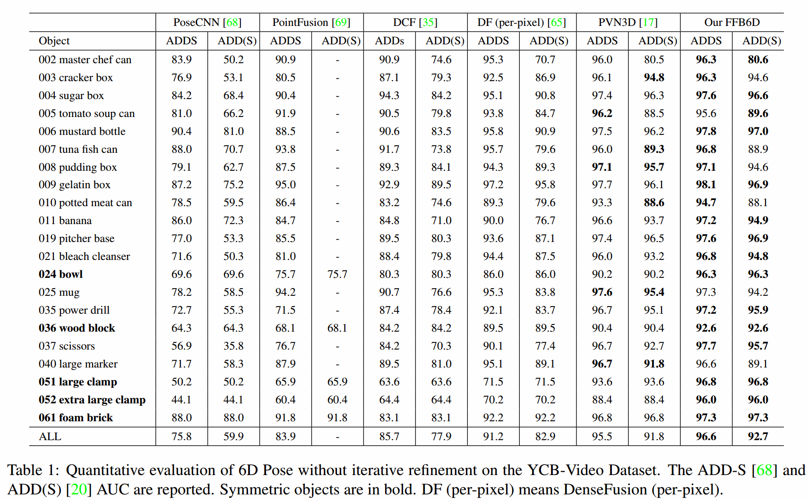
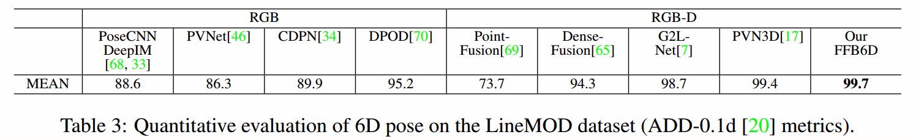
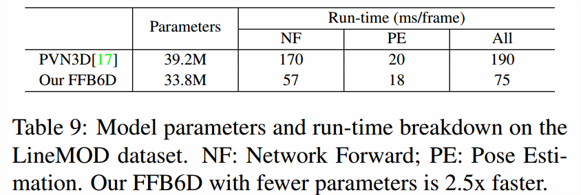

# FFB6D
This is the official source code for the CVPR2021 work, **FFB6D: A Full Flow Biderectional Fusion Network for 6D Pose Estimation**.

## Introduction
In this work, we present FFB6D, a **F**ull **F**low **B**idirectional fusion network designed for **6D** pose estimation from a single RGBD image. Our key insight is that appearance information in the RGB image and geometry information from the depth image are two complementary data sources, and it still remains unknown how to fully leverage them. Towards this end, we propose FFB6D, which learns to combine appearance and geometry information for representation learning as well as output representation selection. Specifically, at the representation learning stage, we build **bidirectional** fusion modules in the **full flow** of the two networks, where fusion is applied to each encoding and decoding layers. In this way, the two networks can leverage local and global complementary information from the other one to obtain better representations. Moreover, at the output representation stage, we designed a simple but effective 3D keypoints selection algorithm considering texture and geometry information of objects, which simplify keypoint localization for precise pose estimation. Experimental results show that our method outperforms the state-of-the-art by large margins on several benchmarks.

## Results
- Evaluation result on the YCB-Video dataset:

- Evaluation result on the LineMOD dataset:

- Robustness upon occlusion:

- Parameters and speed on one 2080Ti:

## Source Code
  Will be coming soon.

